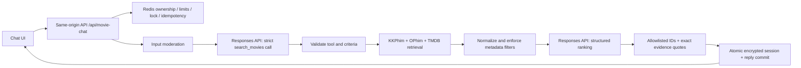

# T-Hexa movie assistant

## Runtime and data flow

`/tro-ly-phim` is a Vietnamese chat interface. The global header links to it. The player and normal movie search remain separate.

This is a bounded, application-owned harness, not an unrestricted autonomous agent. The model cannot execute code, browse arbitrary URLs, write to external systems, read environment variables, or select another tool. The first Responses call must emit exactly one `search_movies` call. The server validates its arguments, runs retrieval, supplies a function output, and makes at most one ranking call with no callable tools. Clarification and off-topic requests skip retrieval/ranking.

Default model: `gpt-4.1-mini`, configurable with server-only `OPENAI_CHAT_MODEL`. OpenAI SDK retries are disabled; maximum output is 1,400 tokens for planning and 1,600 for ranking. Moderation uses `omni-moderation-latest`. Responses use `store:false`; this is not a claim that the provider performs no abuse-monitoring retention.

## Retrieval and evidence

- Names and translated names: up to three short candidate queries. An AI-suggested title is only a retrieval hypothesis, never availability evidence.
- Plot descriptions: AI identifies candidates, then ranks fetched synopses; plot selections require an exact quote from that movie's synopsis.
- Genre/country/year/type: enforced on normalized movie metadata, not merely forwarded as provider query parameters. Multiple genres are AND; multiple countries are OR.
- Actor/director: TMDB person search with an unambiguous exact name, combined credits, then detail credits. Metadata is verified again after retrieval.
- Character: verified against title/synopsis or TMDB credit character names. Character spelling aliases and transliterations are not exhaustive.
- Cinema: a positive source flag with evidence or TMDB theatrical release type 2/3. Unknown is not silently treated as false. An explicit negative source flag is provider evidence, not independent proof. This is historical theatrical release, **not live cinema schedules**.
- Every rendered card is server-built from retrieved evidence. It includes source, source-qualified identity, a local detail URL and checked timestamp. TMDB-based cards say playback is not verified.
- KKPhim/OPhim: maximum six list requests and sixteen detail requests, concurrency four, 6.5-second timeout and 2 MB maximum JSON payload. International: maximum three title searches, at most two person lookups/filmographies, eight detail requests, concurrency three. Requested year ranges sample at most three years in Vietnamese catalogs; TMDB receives the full date range.
- Retrieval is deliberately bounded; it is not an exhaustive catalog index or a vector database. It may miss obscure plots, incomplete metadata, alternative character spellings and films beyond candidate pages. Empty means no verified match in this search, not that a film does not exist. Unavailable/limited sources are disclosed.

## Security boundaries

| Risk | Enforced control | Residual limitation |
|---|---|---|
| Direct/indirect prompt injection | Fixed server instructions; separate user/tool roles; strict schemas; one read-only tool; no executable commands; suspicious metadata text removed | A language model can still misunderstand intent; regex detection is only an early signal |
| Forged tool results or roles | API accepts only message, conversationId, requestId; rejects extra fields; history comes from Redis | A user can state fictional facts in their own message; those do not establish movie evidence |
| Fabricated movie/URL | IDs must exist in retrieved evidence; URLs generated from validated provider identity; text contains no model-generated links | Catalog metadata itself can be incorrect |
| Invented supporting quote | Exact substring of the selected movie's fetched synopsis required | Quoting a true sentence is not a proof that every semantic interpretation is correct |
| XSS/SSRF | React text rendering, no HTML/Markdown execution, fixed source hosts, validated slugs and encoded query arguments | Posters load from provider HTTPS image URLs in the browser, without referrer |
| Cross-site request and session access | Same-origin POST/DELETE, signed HttpOnly SameSite=Strict cookie, owner-namespaced session keys | Anonymous browser sessions are not an account login |
| Cost/concurrency abuse | Redis atomic per-IP minute/day and global daily reservations; one active request per signed browser; bounded calls and output tokens | Global request limit is not a dollar-denominated provider budget; distributed attackers can exhaust daily availability |
| Secret/private text leakage | Key server-side only; key/email redaction; encrypted Redis values; metadata-only logs; store:false | Do not enter sensitive data; input necessarily goes to OpenAI for inference |
| Duplicate/replayed request | Owner-scoped request ID with request fingerprint; cached completion; atomic session/reply commit | Only the last ten minutes of replies are cached |
| Delete/late-response race | Conversation tombstone prevents a delayed completion recreating deleted content; associated cached replies deleted | Operational provider backups follow the Redis provider's policies |
| Upstream failure | Generic safe errors, abort and deadline propagation; Redis failures block paid calls | Partial metadata availability lowers retrieval coverage |

Moderation does not reject ordinary thriller/war/horror search merely because it contains fictional violence. Specific severe categories are rejected. Output guardrails run before a result is streamed. Stage events show progress, not hidden reasoning or unvalidated model tokens.

## State and limits

Upstash Redis is provisioned as `thexa-movie-chat`, free plan, Singapore, automatic plan upgrades disabled. The implementation has no in-memory fallback for production state/limits.

- Anonymous signed browser cookie: 24 hours, Secure on HTTPS.
- Conversation: AES-256-GCM encrypted JSON, 24-hour sliding TTL, maximum 20 successful turns. Last five turns and prior criteria/results are supplied as context.
- Request replay cache: encrypted, ten-minute TTL, removed by conversation deletion.
- Rate limits: 8 requests/minute/IP, 50/day/IP, 200/day/site by default. `CHAT_DAILY_TURN_LIMIT` changes the global cap (1–10,000); all counters use Redis atomic operations and expire.
- Request body: 8 KB maximum bytes; message: 1,500 characters.
- Request deadline: 75 seconds, Vercel function maximum 90 seconds, owner lock 90 seconds. Cancellation aborts model and catalog calls. Reserved quota is not refunded on cancellation/failure.
- Traces: request ID, version, completed/rejected/cancelled/failed, elapsed time, result count and safe error code. No messages, model reasoning, API errors with secrets or raw provider payloads are logged.

## Configuration and operations

Required server-only variables: `OPENAI_API_KEY`, `CHAT_SESSION_SECRET` (at least 32 random characters), `KV_REST_API_URL`, `KV_REST_API_TOKEN` (or Upstash REST equivalents). Never prefix a secret with `NEXT_PUBLIC_`. Never commit environment files. Rotate the originally chat-shared OpenAI key and replace the Vercel secret; redeploy afterward. Rotating the session secret intentionally invalidates existing cookies and encrypted sessions.

The ordinary search remains usable when AI/Redis is unavailable. `GET /api/movie-chat` reports configuration presence, not live health. Retrieve an owned conversation with `GET ?id=UUID`; POST streams progress/result or a safe error; DELETE removes the owned conversation and its replay data. The UI restores the current tab's conversation, offers new/delete, stop, retry with the same idempotency key, and a mobile layout.

Production rollout: typecheck, scoped lint, full unit suite, E2E UI checks, live evaluation, build, then deploy and repeat live evaluation on the alias. Roll back the deployment to remove the UI/API; do not delete the Redis integration unless intentionally retiring stored sessions. Watch Vercel logs filtered by `movie_chat`. For large traffic, configure OpenAI project-level spend controls and evaluate persistent user accounts/stronger bot controls before increasing the global cap.

## Evaluation

- `tests/unit/movie-chat.test.ts`: schema limits, injection signals, ordinary fictional violence, origin/body constraints, encryption/tampering, cookie forgery, grounded IDs and quotes, metadata filtering, unknown cinema data, and tool policy.
- `tests/e2e/movie-chat.spec.ts`: deterministic browser fixtures for stages/cards, follow-up context, retry IDs, cancellation, XSS-safe text, Enter/Shift+Enter, reset and mobile overflow. These fixtures do **not** certify real model accuracy.
- `node scripts/eval-movie-chat.mjs`: live OpenAI + catalog + Redis evaluations for plot recognition, follow-up year, character search, actor+cinema+year and injection refusal. Set `TEST_BASE_URL` explicitly for production. This incurs API usage. Results and timestamp are written to ignored `.data/movie-chat-eval.json`. Real model/provider outputs can vary; passing these cases is not a universal safety guarantee.

Design references: [OpenAI function calling](https://developers.openai.com/api/docs/guides/function-calling), [OpenAI agent safety](https://developers.openai.com/api/docs/guides/agent-builder-safety), [GPT-4.1 mini](https://developers.openai.com/api/docs/models/gpt-4.1-mini), [Upstash Redis TypeScript](https://upstash.com/docs/redis/sdks/ts/overview).
